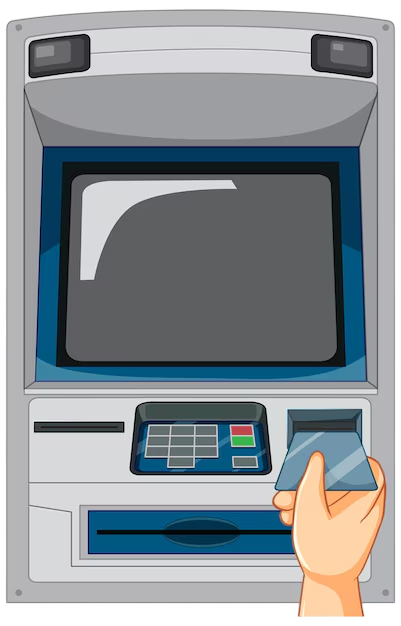
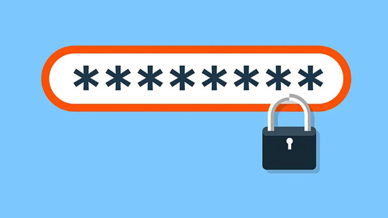
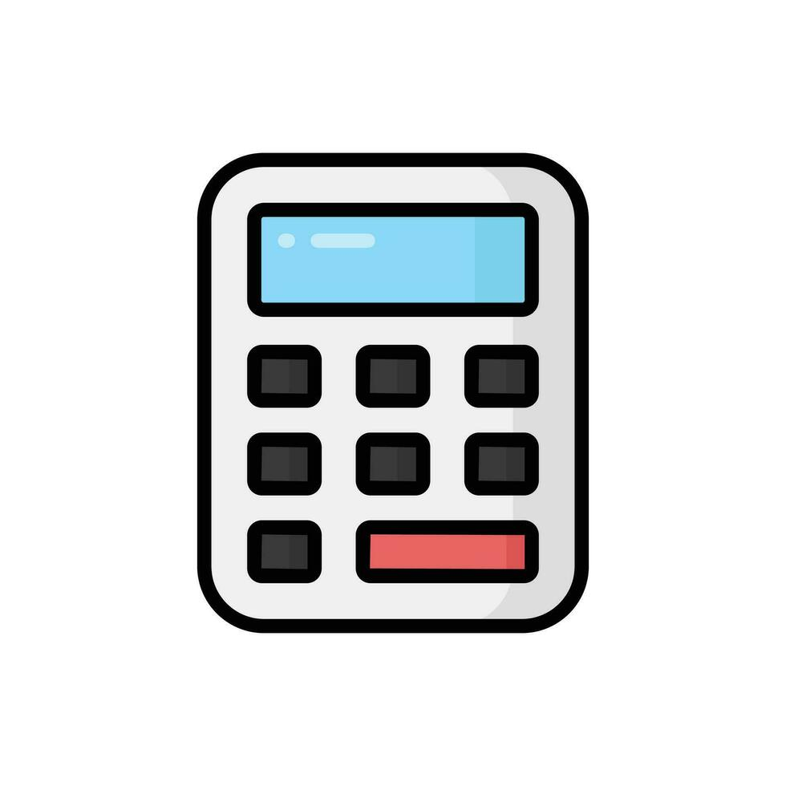

<h1 align='center'>Proyectos C</h1>
Este repositorio alberga varios proyectos que he desarrollado utilizando el lenguaje de programación C. Los proyectos incluyen tanto los trabajos realizados en el contexto académico como aquellos que he creado por iniciativa propia, con el objetivo de mejorar mis habilidades en programación, resolución de problemas y desarrollo de software en general.

 

 

## Proyectos realizados en clase
A lo largo de mis estudios, he trabajado en diversos proyectos en C que me han permitido profundizar en conceptos fundamentales de la programación. Estos proyectos fueron parte de asignaciones o trabajos en clase y cubren una variedad de temas, desde estructuras de datos hasta manejo de memoria y programación orientada a la resolución de problemas.
### Ejemplos:
- Gestor de Base de Datos de un Cajero Automático (ATM)

Un sistema que simula el funcionamiento de un cajero automático, donde se utiliza un archivo de texto para almacenar datos y realizar transacciones. Este proyecto me ayudó a entender el manejo de archivos, estructuras de datos (como listas enlazadas) y conceptos de seguridad en sistemas.

 

- Simulación de un Sistema de Gestión de Archivos

Un programa que simula operaciones básicas de un sistema de archivos, como crear, leer y eliminar archivos. El proyecto hizo énfasis en el manejo de punteros y el acceso directo a memoria.

 

## Proyectos Personales
Además de los proyectos académicos, he desarrollado proyectos personales para explorar más a fondo diferentes aspectos del lenguaje C y expandir mis conocimientos en áreas específicas, como la creación de aplicaciones de consola, programación de sistemas y herramientas para automatizar tareas.

### Ejemplos:
- Juego de Ahorcado en C

Un juego de consola basado en el clásico "Ahorcado". Implementé características como la validación de entrada, control de errores y una interfaz sencilla para hacer la experiencia de usuario más atractiva.

 

- Generador de Contraseñas Seguras

Un programa que genera contraseñas seguras basadas en criterios definidos por el usuario (longitud, caracteres especiales, etc.). Este proyecto me permitió practicar la generación de cadenas aleatorias y el manejo de funciones de entrada/salida.

 

- Calculadora de Operaciones Matemáticas

Una calculadora simple que realiza operaciones aritméticas básicas y permite la extensión de nuevas operaciones. Fue una excelente forma de trabajar con funciones y estructuras de control de flujo en C.

## Tecnologías y Herramientas Utilizadas
Lenguaje: C
Entorno de Desarrollo: Visual Studio Code, GCC (GNU Compiler Collection)
Herramientas Adicionales: Makefile, Git/GitHub
